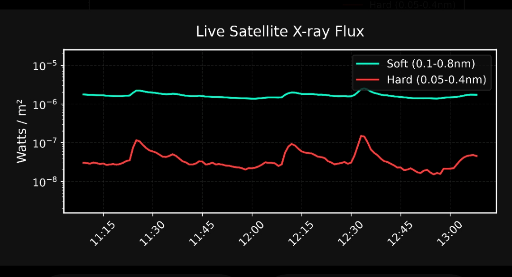
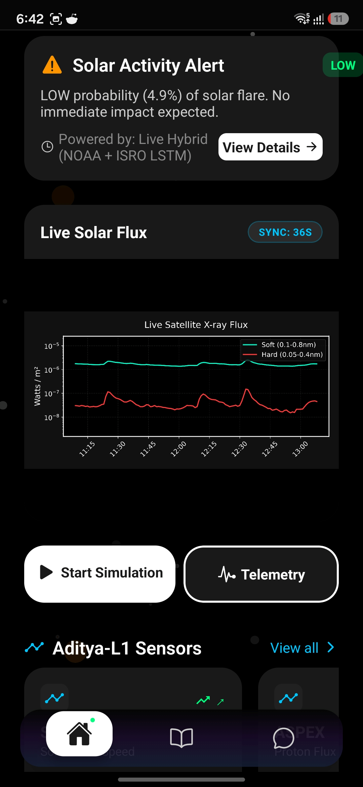
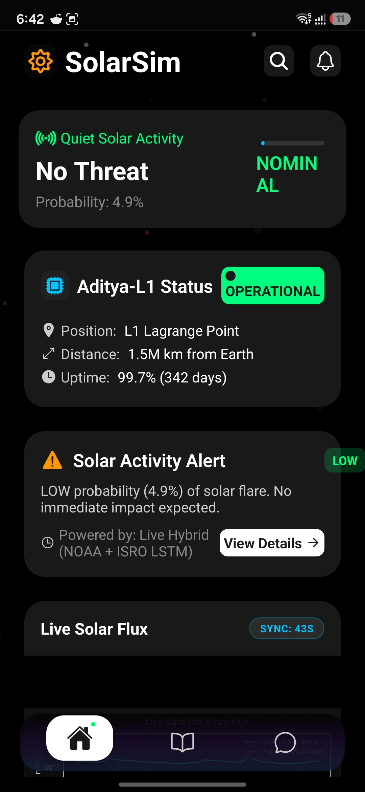

<div align="center">
  
  
  
  
  
  <br />

  <h1>🚀 SolarSim: Deep-Space Weather Forecaster</h1>
  <p><strong>Nowcasting and Forecasting of Solar Flares using Aditya-L1 (SoLEXS & HEL1OS)</strong></p>
  <p><em>Built for ISRO Problem Statement 15</em></p>
</div>

<p align="center">
  
  
  
</p>

---

## 🛰️ Overview

Space weather anomalies, specifically **Solar Flares**, pose critical risks to modern satellite electronics. **SolarSim** is a full-stack, autonomous early-warning system designed to tackle ISRO Problem Statement 15. 

It acts as a **Digital Twin**, processing proxy dual-band X-ray data (Soft and Hard X-rays) to emulate Aditya-L1's **SoLEXS** and **HEL1OS** payloads. The system utilizes a PyTorch Long Short-Term Memory (LSTM) neural network to analyze time-series flux gradients, generating an anomaly probability tensor. This data is streamed in real-time to a native mobile application, bringing deep-space telemetry directly to the edge.

While the primary directive is detecting high-energy X-ray signatures for Solar Flares, SolarSim simultaneously monitors secondary payloads (SWIS & PAPA) for tracking Coronal Mass Ejections (CMEs).

---

## ✨ Key Features

- **Algorithmic Nowcasting:** Instantly detects abrupt gradients in X-ray light curves to catalog active flares.
- **LSTM Forecasting:** Neural network continuously analyzes combined soft/hard X-ray flux to predict flare probability with a 15–30 minute lead time.
- **Cross-Platform Mobile Edge-Client:** A beautiful, dark-mode React Native application deployable to iOS and Android.
- **Zero-Latency Graphing:** Matplotlib lightcurves are rendered mathematically on the cloud backend and streamed to the app as lightweight image buffers, saving mobile battery and CPU overhead.
- **Network Resilience:** Intelligent UI fallbacks automatically preserve the last-known safe data state if the satellite uplink drops.

---

## 🛠️ Technology Stack

**Backend & Machine Learning (Cloud)**
- **Python 3:** Core programming and fusion algorithms.
- **PyTorch:** Deep learning framework for the LSTM time-series model.
- **FastAPI & Uvicorn:** Asynchronous REST API serving low-latency inference data.
- **Matplotlib & NumPy:** Programmatic rendering of logarithmic light curves.
- **Hosting:** Render.com (Web Services).

**Edge Interface (Mobile)**
- **React Native & Expo:** Cross-platform application framework.
- **TypeScript:** Strict type-safety during UI development.
- **Axios:** For resilient backend polling.
- **Hosting:** Expo Application Services (EAS) for direct APK compilation.

---

## 📡 Endpoints

The API is highly optimized for minimal payload overhead and continuous polling.

| Endpoint | Method | Description |
| :--- | :---: | :--- |
| `/api/v1/status` | `GET` | Returns the primary JSON payload containing LSTM confidence levels, anomaly alerts, and digital twin sensor data. |
| `/api/v1/lightcurve` | `GET` | Returns a dynamically generated, 300 DPI Matplotlib PNG of the current X-ray flux (padded log-scale y-axis). |

---

## 🚀 Quick Start (Local Development)

### 1. Run the Python AI Backend
```bash
cd backend
python -m venv venv
source venv/bin/activate  # (or venv\Scripts\activate on Windows)
pip install -r requirements.txt
uvicorn main:app --reload --port 10000
```
*The backend will now be serving live predictions and graphs at `http://localhost:10000`.*

### 2. Run the React Native Mobile App
```bash
cd app
npm install
npx expo start
```
*Scan the QR code with the Expo Go app on your phone, or press `a` to open in an Android Emulator.*

---

## 📚 Scientific References & Literature

Our pipeline and feature engineering techniques are rigorously informed by the latest heliophysics calibration literature (2025-2026):

1. **SoLEXS Ground Calibration and In-flight Performance**  
   *arXiv: [2509.26292](https://arxiv.org/abs/2509.26292)* — Crucial for understanding SoLEXS cross-calibration with GOES proxy data and modeling thermal flare evolution.
2. **HEL1OS Instrument Paper**  
   *arXiv: [2512.12679](https://arxiv.org/pdf/2512.12679)* — Dictated our data fusion strategy, utilizing the synergy between SoLEXS (soft/thermal) and HEL1OS (hard/non-thermal) emissions for impulsive phase detection.
3. **Iron Fluorescence in X-class Flares: Aditya-L1/SoLEXS Observations**  
   Provided real-world spectral anomaly characteristics during high-energy events, directly shaping our LSTM feature weighting.
